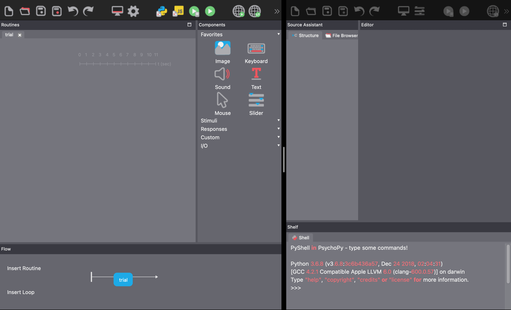
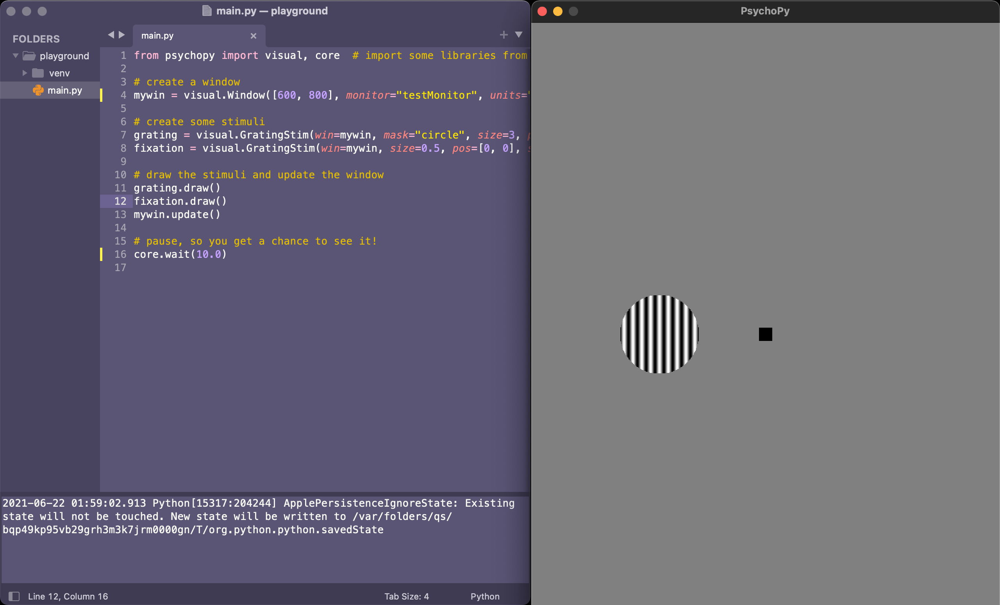

## macOS Specifications

Here are the specs of my hardware and the version of psychopy I am using:
```
Model: Macbook Pro 2015 13-inch
Processor: 2.7 GHz Dual-Core Intel Core i5
Memory: 8 GB 1867 MHz DDR3
Graphics: Intel Iris Graphics 6100 1536 MB
OS: macOS Big Sur 11.4

Python: Python3.9
PsychoPy: v2021.1.4
```

## Via Homebrew

Installed GUI version of PsychoPy into my Applications directory using homebrew (or the standalone installer).
```bash
# install Homebrew on macOS
/bin/bash -c "$(curl -fsSL https://raw.githubusercontent.com/Homebrew/install/HEAD/install.sh)"

# if not already installed
brew install python # will install latest version (3.9) automatically

# install PsychoPy app
brew install --cask psychopy
```

\
This works well and I'm able to open the program:

<p align="center">
  
</p>


## Setup for code only

*But* I also wanted to be able to prepare for programmatic-only usage instead of only interface+code. I feel like this can be more flexible in some cases where the GUI may not allow for precise customizations.

My directory for this summer project looks like this. I created a test directory called ```playground``` within ```programmatic```:
```bash
└── psychopy
    ├── demos
    ├── graphical
    └── programmatic
		└── playground
```

\
It's a fairly large package and is constantly updated, so installing it globally would not be the best idea; I can change directory into the ```playground``` directory, create a virtualenv to install psychopy using pip. This way, the entire psychopy package can be used isolated within that folder only.
```bash
cd psychopy/programmatic
virtualenv venv # creates a virtual environment using python 3.9
pip install psychopy # installs psychopy and all its dependencies
touch main.py # create main.py file

# it should now look like this.
└── psychopy
    ├── demos
    ├── graphical
    └── programmatic
		└── playground
			├── venv
			│	└── "psychopy source"
			└── main.py
```

## Sample code
I took the sample code from their "scripting only" docs and put it into main.py using any text editor:
```python
from psychopy import visual, core  # import some libraries from PsychoPy

#create a window
mywin = visual.Window([800,600], monitor="testMonitor", units="deg")

#create some stimuli
grating = visual.GratingStim(win=mywin, mask="circle", size=3, pos=[-4,0], sf=3)
fixation = visual.GratingStim(win=mywin, size=0.5, pos=[0,0], sf=0, rgb=-1)

#draw the stimuli and update the window
grating.draw()
fixation.draw()
mywin.update()

#pause, so you get a chance to see it!
core.wait(10.0)
```
\
After pressing ```cmd+B``` to compile it, we should expect to see a window pop up with multiple stimuli and it should close after 10 seconds:

<p align="center">
  
</p>


\
Now that we have everything set up, we should proceed the actual demos and take note of any difficulties and/or successes. The visual search task would be a good start.

## Open source packages

I decided to write these logs in markdown as a form of documentation so it can be easy to view updates. I'm using Hugo static site generator with a [book theme](https://github.com/alex-shpak/hugo-book) because it is clean and easy to setup for documentation purposes.
