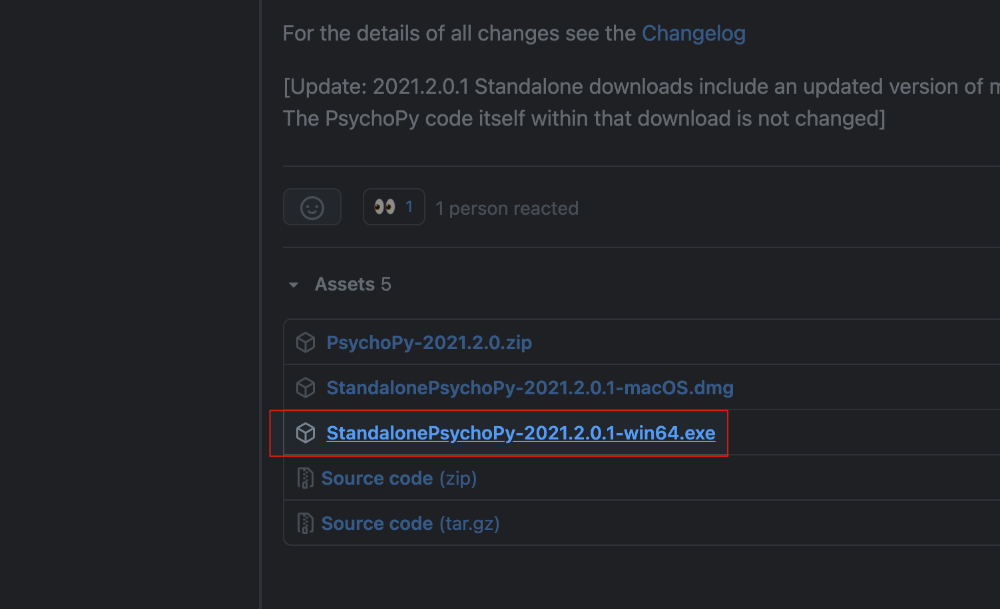
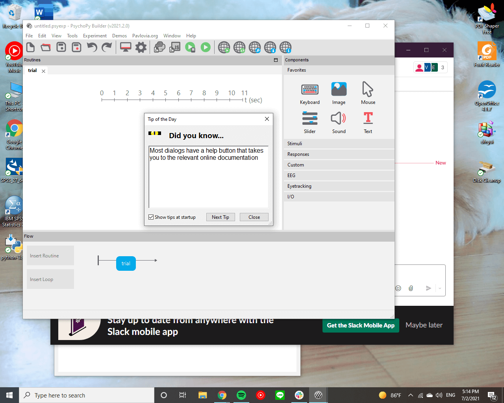
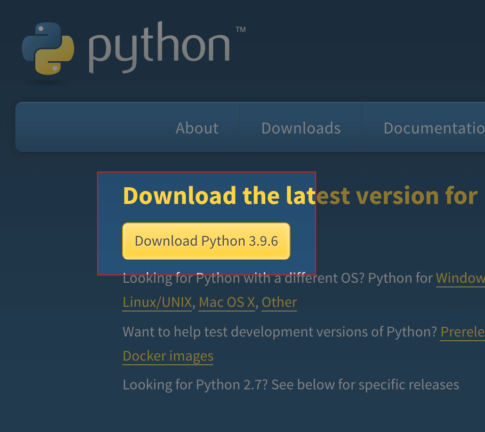
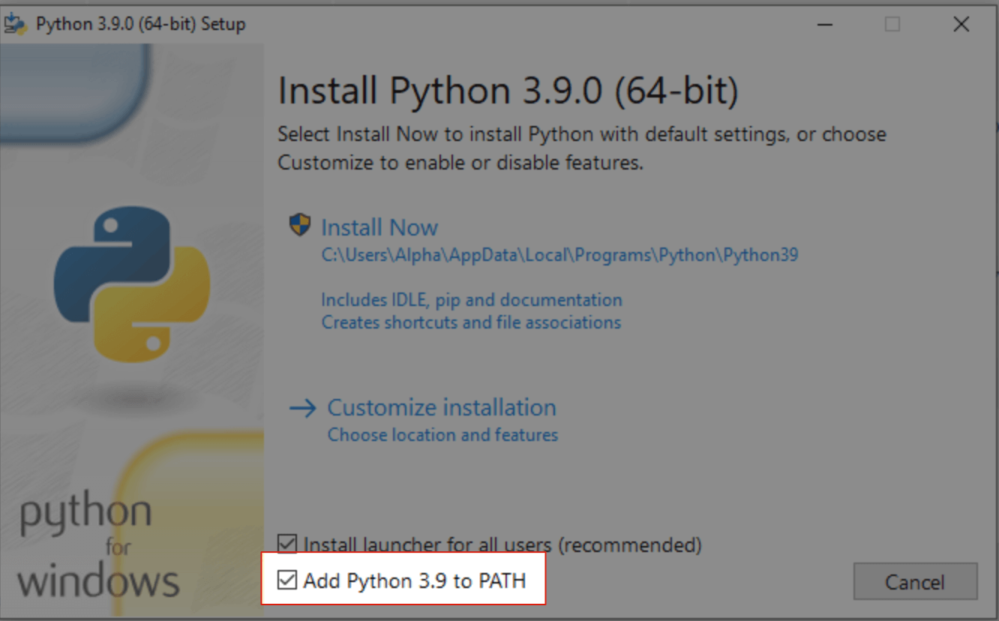
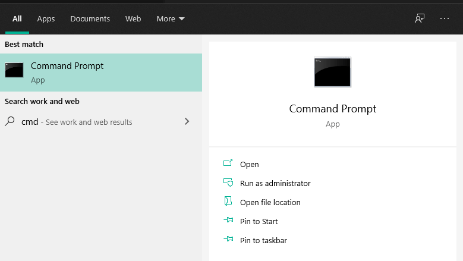
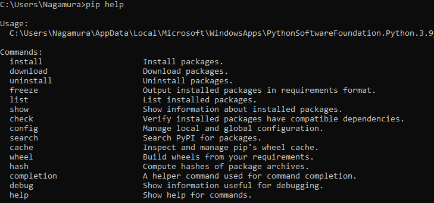
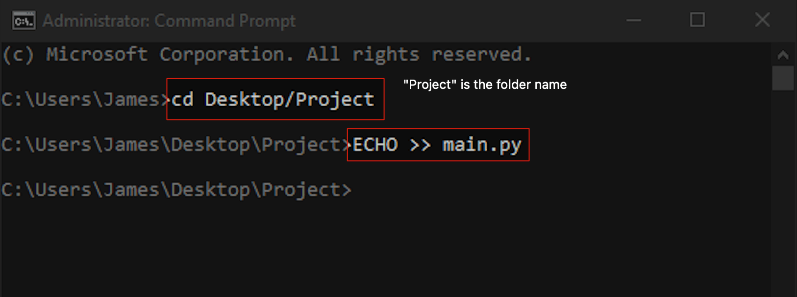
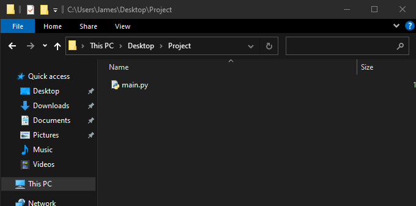

## Windows Specifications
The background of my hardware specifications with the version of Python and PsychoPy I am using are shown below: 
```
Edition: Windows 10 Pro
Processor: Intel(R) Core(TM) i3-2100 CPU @ 3.10GHz 3.10GHz
Installed RAM: 4.00 GB
System Type: 64-bit operating system, x64-based processor
OS Build: 19041.1052
Python: Python 3.9 64-bit
PsychoPy: v2021.2.0
```

## Method 1. Install Standalone executable

The first way to install PsychoPy is by using ```.exe``` file. Navigate to their [github repository](https://github.com/psychopy/psychopy/releases) and find [StandalonePsychoPy-2021.2.0.1-win64.exe](https://github.com/psychopy/psychopy/releases/download/2021.2.0/StandalonePsychoPy-2021.2.0.1-win64.exe)

<p align="center">
  
</p>

Open the PsychoPy app in your applications and it should open the PsychoPy builder.
<p align="center">
  
</p>

## Method 2. Install Python and Pip

The second way to utilize psychopy is via the pip package. First check if pip is installed on your computer. You can do this using:

```python
pip --version
```

If it isn't installed, you should go to [python.org](https://python.org) and select the latest installer for python 3.9. My windows installation came with python 3.6.6 but not pip, so this might be the case for you. The site will auto-detect the OS of your machine so just select download. At the time of this post, the latest is Python 3.9.6. The installer will be an exe.

<p align="center">
  
</p>

When you first run it, make sure to check ```Add Python 3.9 to PATH```. This will add py to your environment variables so you can use the latest version of python in the command prompt.

<p align="center">
  
</p>

## 2.1 Run in command prompt

Once the setup is complete, you can ensure the latest version of python is running by typing `python`, `pip --version` or `pip help`in a new instance of your command prompt:
<p align="center">
  
</p>

<p align="center">
  
</p>

If running `python` still gives you the pre-installed version of python (3.6.6 in this case), you can try running `py`. It should now show 3.9.6.

## 2.2 pip install PsychoPy

Now that you have the latest version of python and pip on your computer, you can install psychopy using pip.

1. Install PsychoPy via pip through cmd by typing `pip install psychopy`
	- This will install psychopy as a global package. After running `pip list`, you will see `wheel`, `setuptools`, and `psychopy` (and psychopy's dependencies) listed out.
2. Create your designated project folder.
	- Navigate to that folder, `right-click > new > folder`
3. While in the command prompt, use `cd` to change directory to the folder you created.
	- When you first open command prompt, you will be in your root directory.
		- If you created the folder in your Desktop, then type: `cd Desktop/{Folder Name}`
		- Run `ECHO >> main.py`, which will create an empty python file called 'main.py'.

<p align="center">
  
</p>
<p align="center">
  
</p>

4. Open `main.py` using any text editor of your choosing. Insert this code snippet (from the official docs) like we did in the macOS setup.

```python
from psychopy import visual, core, event #import some libraries from PsychoPy

#create a window
mywin = visual.Window([800,600],monitor="testMonitor", units="deg")

#create some stimuli
grating = visual.GratingStim(win=mywin, mask='circle', size=3, pos=[-4,0], sf=3)
fixation = visual.GratingStim(win=mywin, size=0.2, pos=[0,0], sf=0, rgb=-1)

#draw the stimuli and update the window
while True: #this creates a never-ending loop
    grating.setPhase(0.05, '+')#advance phase by 0.05 of a cycle
    grating.draw()
    fixation.draw()
    mywin.flip()

    if len(event.getKeys())>0:
        break
    event.clearEvents()

#cleanup
mywin.close()
core.quit()
```

While you're still in the Project directory that you made earlier, you should type in `python main.py` in the command prompt. It should output a window with some test stimuli. Congrats, it now runs on windows!
